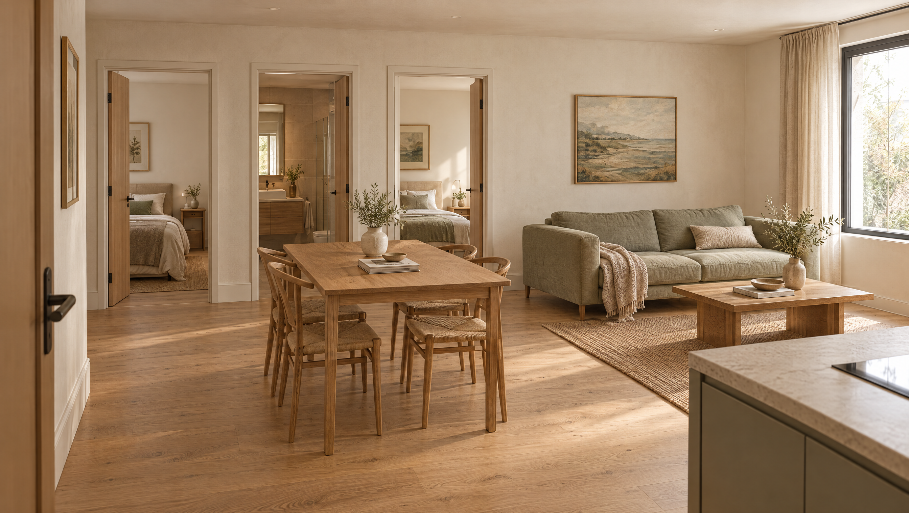

# 3D LAB // 003 — Floor Plan → Walkthrough

**Don't just read the plan. Step inside it.**

Plan / Space is a small, runnable AI Concept Lab experiment: review a floor plan, explore a furnished 3D model, and compare a layout decision. A separately generated Higgsfield film shows the intended atmosphere.



## Run it

Requires Node.js 22.12+ and a modern browser with WebGL.

```sh
npm ci
npm run build
npm start
```

Open **http://127.0.0.1:3016**. The included 72 m² apartment, furniture comparison, walkthrough controls and exports work without API keys. After source edits, run `npm run build` again; the server serves `dist`, not a hot-reloading Vite session.

## Try the experiment

1. Explore the dollhouse. Drag to orbit and scroll to zoom.
2. Select **Walk inside**. Use arrows/WASD or the on-screen controls. Left/right turn; up/down move.
3. Compare the four-seat and six-seat dining tables. The table-to-sofa edge gap changes from **0.95 m to 0.65 m**, calculated from the same geometry used to render them.
4. Export the reviewed JSON, a PNG view, a furnished GLB, or a Higgsfield generation brief.
5. Select **Tour all rooms** for a roughly 50-second route through the entrance, kitchen, living area, main bedroom, bathroom and bedroom/study. Pause, scrub or jump to any stop. The route uses door gaps and avoids primary furniture including dining chairs.
6. Play the included 32-second cinematic concept below the model.

The edge gap excludes pulled-out chairs and people. It is not an accessibility assessment or a recommended minimum clearance.

## Use your own floor plan

Upload PNG, JPG, WebP (up to 5 MB), or reviewed JSON. JSON opens in the review panel and never replaces the current model until you click **Build reviewed plan**. Images stay in your browser until you explicitly select **Extract plan with AI**.

For optional image extraction, copy `.env.example` to `.env`, set `OPENAI_API_KEY`, and restart the server. `OPENAI_MODEL` defaults to `gpt-6-astra`; your account must have access to the configured model. Enter the plan's overall width and depth in metres. Review the extracted room sizes, wall segments, door gaps, furniture and assumptions before building.

The AI extracts an approximate, single-storey rectangular-room schema. This starter is not a general CAD/BIM importer. Irregular outlines, stairs, multi-storey plans and ambiguous scale need manual modelling. The review editor exposes JSON to keep the starter compact.

## What is real here?

| Layer | Implementation |
| --- | --- |
| Floor plan and 3D | The same validated JSON drives SVG, Three.js geometry and measurements. |
| AI extraction | Server-side OpenAI Responses API with an image and strict structured output; optional paid API. |
| Materials | Physical materials with separate roughness, fabric sheen, oak microstructure, stone clearcoat and metal reflections. |
| Lighting | Warm directional daylight, cooler fill, environment reflections, contact shadows and ACES tone mapping. |
| Cinematic preview | Four actual Higgsfield clips assembled into a 32-second room-by-room concept tour. |
| Blender | Export a GLB and import it into Blender; an optional import/camera/light script is included. Blender was not used to generate the included film. |

**The film is an AI interpretation of the sample plan, not a dimensionally exact render of the GLB.** It changes details, including chair count. Use the editable model for geometric comparisons, and the film for mood/material presentation. The film does not change when you edit your plan. This app does not submit Higgsfield jobs automatically.

## Included

- Runnable frontend and small Node server, locked dependencies and `.env.example`
- Auth/rate limits for optional extraction; no server key in the browser
- Sample plan, source SVG/PNG, furnished procedural model and GLB export
- Higgsfield still and video, prompts, provenance and credit record
- Five Instagram images at **1080 × 1350 (4:5)**, caption and comment/DM templates
- Reproducible slide renderer, meaningful tests and build checks
- [BUILD.md](BUILD.md), [validation notes](docs/validation.md), [Blender handoff](blender/README.md)

## Checks and security

```sh
npm run check
npm run instagram
```

The sample flow and browser UI were checked locally. Extraction request/response and failure handling were tested with fixtures. **Live OpenAI image extraction was not run during this release because no API key was configured.** Blender import/render is an optional handoff, not a claimed tested render.

The server binds to loopback by default. Non-loopback hosting requires an `APP_ACCESS_TOKEN` of at least 32 characters; use HTTPS in front of it. The starter permits one extraction at a time and six attempts per hour per connecting IP. It is not a multi-tenant hosted service. Uploaded images are not saved by the server; provider retention policies still apply. Don't put real keys in sample files, source, screenshots or commits.

Source code: MIT. Generated sample media can be reused with the demo subject to provider terms. Third-party names and the Higgsfield mark identify the tools used, and are not covered by the code's MIT licence. No endorsement is implied.
